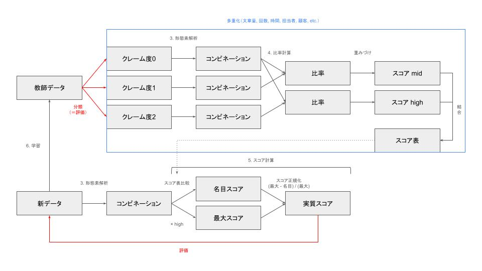
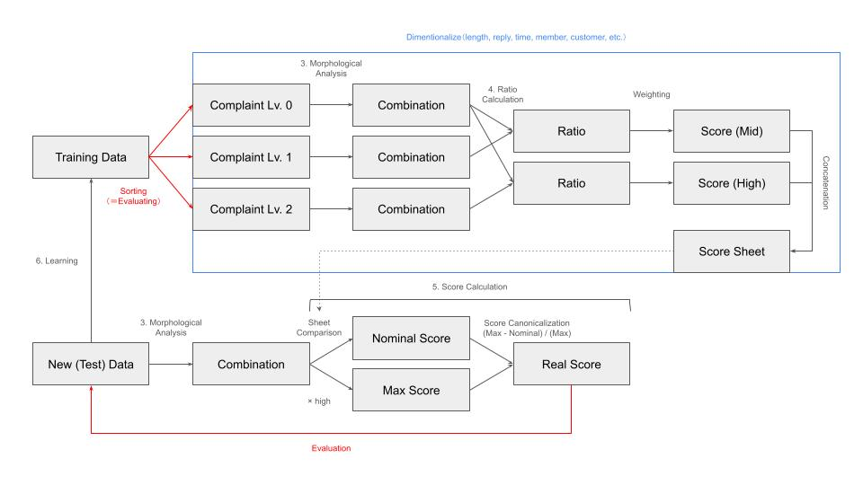

# 202407_Summer_Intern README

Language: [日本語](#日本語) | [English](#English)

English description follows the Japanese

## 日本語

### 概要
このプロジェクトには、インターンシップでの成果物が含まれています。自然言語処理を用いたデータ分析のためのPythonスクリプトが含まれています。以下のスクリプトが含まれています：
- `co_occurrence_network.ipynb`
- `word_cloud_member.ipynb`
- `word_cloud.ipynb`
- `mail_score_weighted.ipynb`

各スクリプトの機能と使用方法について以下に説明します。

### 機能
- `co_occurrence_network.ipynb`: 共起ネットワークを構築し、可視化します。
- `word_cloud_member.ipynb`: 指定されたメンバーのワードクラウドを作成します。
- `word_cloud.ipynb`: 顧客対応履歴とインシデントに基づくワードクラウドを作成します。
- `mail_score_weighted.ipynb`: 問い合わせメールのスコアリングを行い、クレームの可能性を評価します。

### `mail_score_weighted.ipynb`のアルゴリズム

以下の図は、`mail_score_weighted.ipynb`のアルゴリズムを可視化した図です。



### 使用方法
Google Colabを使用して以下の手順を実行します。

1. Google Colabでいずれかのファイルを開きます：
  - [co_occurrence_network](https://colab.research.google.com/github/Sota-42k/202407_Sekisho/blob/ba262dc92e81fcea609aae894a1b255c53de5dc8/co_occurrence_network.ipynb)
  - [word_cloud_member.ipynb](https://colab.research.google.com/github/Sota-42k/202407_Sekisho/blob/ba262dc92e81fcea609aae894a1b255c53de5dc8/mail_score_weighted.ipynb)
  - [word_cloud.ipynb](https://colab.research.google.com/github/Sota-42k/202407_Sekisho/blob/ba262dc92e81fcea609aae894a1b255c53de5dc8/word_cloud.ipynb)
  - [mail_score_weighted.ipynb](https://colab.research.google.com/github/Sota-42k/202407_Sekisho/blob/ba262dc92e81fcea609aae894a1b255c53de5dc8/word_cloud_member.ipynb)
2. ノートブックのセルを順番に実行します。（ライブラリのインストールが必須です。また、基本的にGoogle Driveのマウントも必要になります。その際、作業ディレクトリのパスは書き換えてください。）

### ディレクトリ構造
```
/project-root
│── co_occurrence_network.ipynb
│── word_cloud_member.ipynb
│── word_cloud.ipynb
└── mail_score_weighted.ipynb
```

各ノートブックには、適切なCSV形式のデータファイルが必要です。データファイルはGoogle Driveに保存し、ノートブック内で参照します。

### 支援
コード改善のアドバイス等を歓迎します。手順は以下の通りです。

1. リポジトリをフォークします。
2. 新しいブランチを作成します。
   ```bash
   git checkout -b feature-branch
   ```
3. 変更を加えてコミットします。
   ```bash
   git commit -m "Description of the feature"
   ```
4. ブランチにプッシュします。
   ```bash
   git push origin feature-branch
   ```
5. プルリクエストを作成します。

### 免責事項

本プロジェクトのノートブックおよびスクリプトは、作成者の成果物を公開することを目的としています。以下の点にご注意ください。

1. **正確性**:
   - 本プロジェクトの内容は、学習プログラムを含みます。学習の過程は正確であることを目指していますが、完全な正確性を保証するものではありません。使用者は自己の責任において使用してください。

2. **依存関係**:
   - 本プロジェクトには、サードパーティ製のライブラリやツールが含まれています。これらのライブラリやツールの使用に関する問題やバグについて、本プロジェクトの作成者は一切の責任を負いません。

3. **データの使用**:
   - 本プロジェクトで使用されるデータセットは、サンプルデータです。データセットの使用に関しては、各データセットのライセンス規約に従ってください。

4. **成果物の使用**:
   - 本プロジェクトのコードおよび成果物を使用して得られた結果について、本プロジェクトの作成者は一切の責任を負いません。結果の解釈や使用に関しては、自己の責任において行ってください。

5. **ライセンス**:
   - このプロジェクトはMITライセンスの下でライセンスされています。詳細については、[LICENSE](LICENSE)ファイルを参照してください。

本プロジェクトを使用することにより、上記の条件に同意したものとみなされます。使用者は、自身の判断と責任において本プロジェクトを使用してください。


## English

### Overview
This project is the output from the internship experience. This includes Python scripts for data analysis using natural language processing. The following scripts are included:
- `co_occurrence_network.ipynb`
- `word_cloud_member.ipynb`
- `word_cloud.ipynb`
- `mail_score_weighted.ipynb`

Below is a description of the functionalities and usage of each script.

### Features
- `co_occurrence_network.ipynb`: Constructs and visualizes a co-occurrence network.
- `word_cloud_member.ipynb`: Creates a word cloud for a specified member.
- `word_cloud.ipynb`: Creates word clouds based on customer support history and incidents.
- `mail_score_weighted.ipynb`: Scores inquiry emails and evaluates the likelihood of complaints.

### Algorithm of `mail_score_weighted.ipynb`

The following figure visualizes the algorithm used in `mail_score_weighted.ipynb`.



### How to Use
The following steps are to be executed using Google Colab.

1. Open following files on Google Colab:
  - [co_occurrence_network](https://colab.research.google.com/github/Sota-42k/202407_Sekisho/blob/ba262dc92e81fcea609aae894a1b255c53de5dc8/co_occurrence_network.ipynb)
  - [word_cloud_member.ipynb](https://colab.research.google.com/github/Sota-42k/202407_Sekisho/blob/ba262dc92e81fcea609aae894a1b255c53de5dc8/mail_score_weighted.ipynb)
  - [word_cloud.ipynb](https://colab.research.google.com/github/Sota-42k/202407_Sekisho/blob/ba262dc92e81fcea609aae894a1b255c53de5dc8/word_cloud.ipynb)
  - [mail_score_weighted.ipynb](https://colab.research.google.com/github/Sota-42k/202407_Sekisho/blob/ba262dc92e81fcea609aae894a1b255c53de5dc8/word_cloud_member.ipynb)
2. Execute the cells in the notebook sequentially.(Installment of the libraries is required. Mounting Google Drive is generally required. Make sure to change the path of the working directory.)

### Directory Structure
```
/project-root
│── co_occurrence_network.ipynb
│── word_cloud_member.ipynb
│── word_cloud.ipynb
└── mail_score_weighted_list.ipynb
```

Each notebook requires appropriate data files in CSV format. The data files should be stored in Google Drive and referenced within the notebooks.

### Support
Support is greatly appreciated. Please follow these steps to contribute:

1. Fork the repository.
2. Create a new branch:
   ```bash
   git checkout -b feature-branch
   ```
3. Make your changes and commit them:
   ```bash
   git commit -m "Description of the feature"
   ```
4. Push to the branch:
   ```bash
   git push origin feature-branch
   ```
5. Open a pull request.

### Disclaimer

The notebooks and scripts in this project are intended to showcase the creator's work. Please note the following points:

1. **Accuracy**:
   - This project includes learning algorithm. While the learning process aims for accuracy, it does not guarantee complete accuracy. Users should use the project at their own risk.

2. **Dependencies**:
   - This project includes third-party libraries and tools. The project creator assumes no responsibility for any issues or bugs related to the use of these libraries and tools.

3. **Data Usage**:
   - The datasets used in this project are sample data. Please adhere to the license terms of each dataset when using them.

4. **Use of Outputs**:
   - The project creator assumes no responsibility for the results obtained by using the code and outputs of this project. Interpretation and use of the results are at the user's own risk.

5. **License**:
   - This project is licensed under the MIT License. For details, please refer to the [LICENSE](LICENSE) file.

By using this project, you agree to the above conditions. Users should use this project at their own discretion and responsibility.
